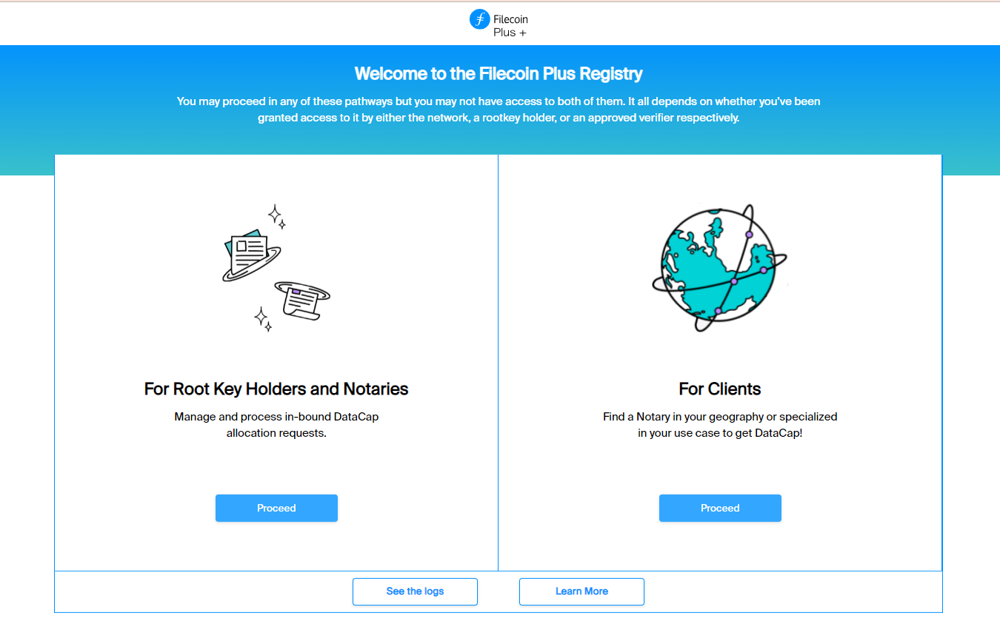
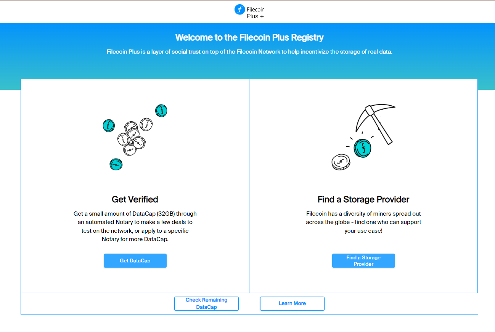
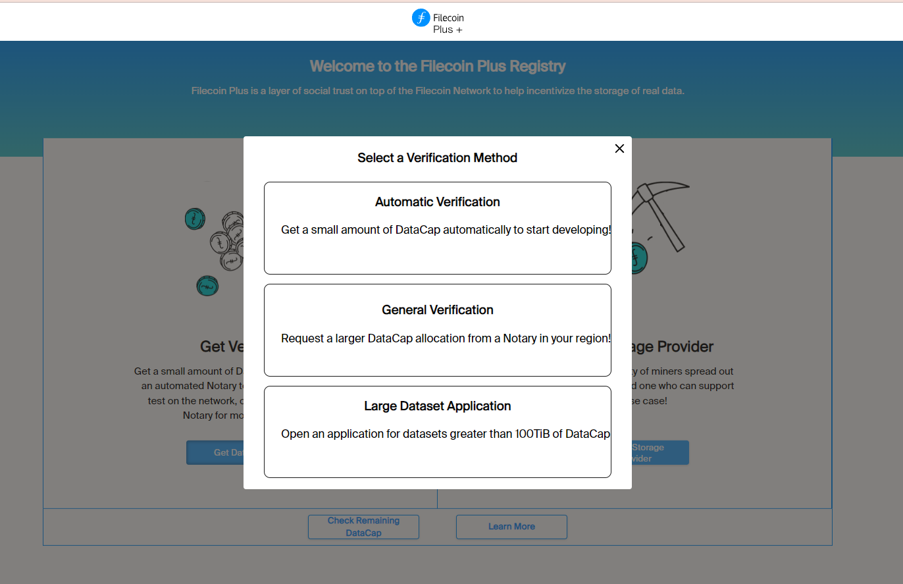
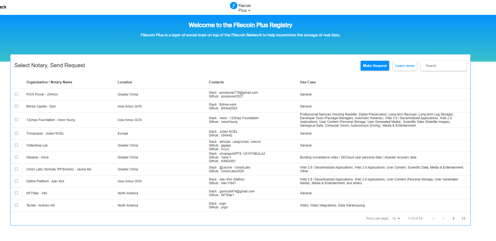
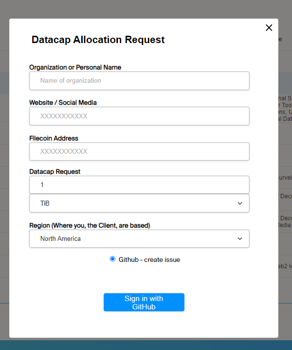
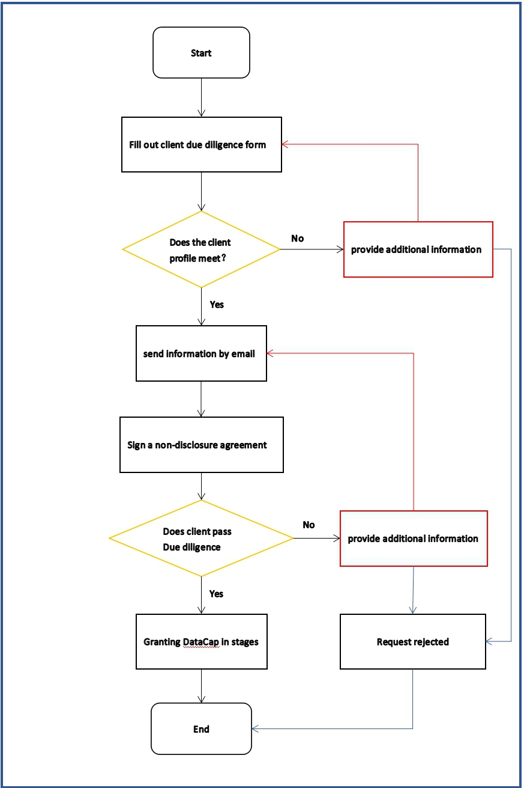

In order to ensure the authenticity of the information and reputation of our clients, we will verify the online and physical identity and reputation of our clients.

First, a flow chart was created to help the client understand the steps to take when applying for a DataCap.

 Please go to the [Filecoin Plus Registry](https://plus.fil.org).Enter as a client with a github account.

Click apply for datacap, then select the application type.

In the list of notaries, select the notary you have identified and make a request.

According to the form, fill in the following information.

Secondly,Clients are required to fill out a form that includes information such as the client's subject name, jurisdiction of the subject, registration number, business location, contact person and title, email address, main business description, and the Datacap quota applied for, which will serve as the basis for our initial assessment of whether the client meets the requirements.

Third,for clients who pass the preliminary investigation, we will conduct a deeper due diligence, including information such as the main registration certificate, proof of main business address, etc. These inconvenient information we need the client to send to our email, we understand that clients have concerns about the leakage of the main information, so we will sign a confidentiality agreement with the client, see link for details.

Fourth,after the client has passed all the verifications, we will grant the client DataCap in stages, which will be consistent with the Fil+ rules.

